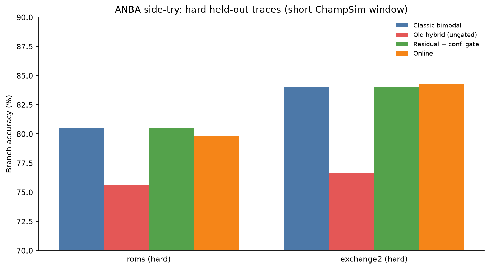
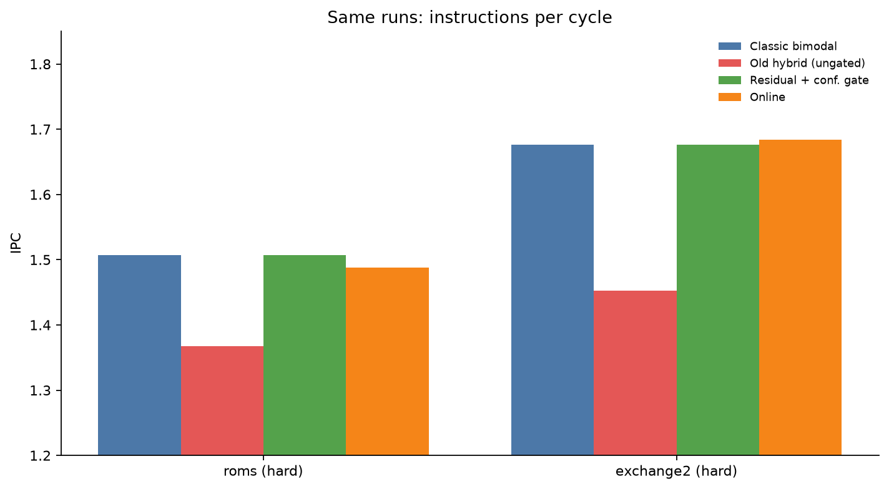
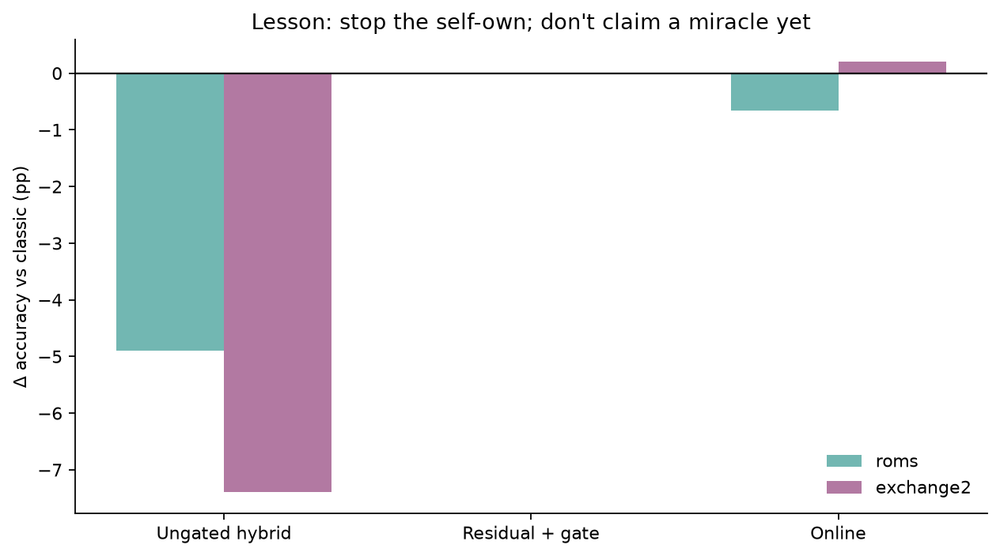
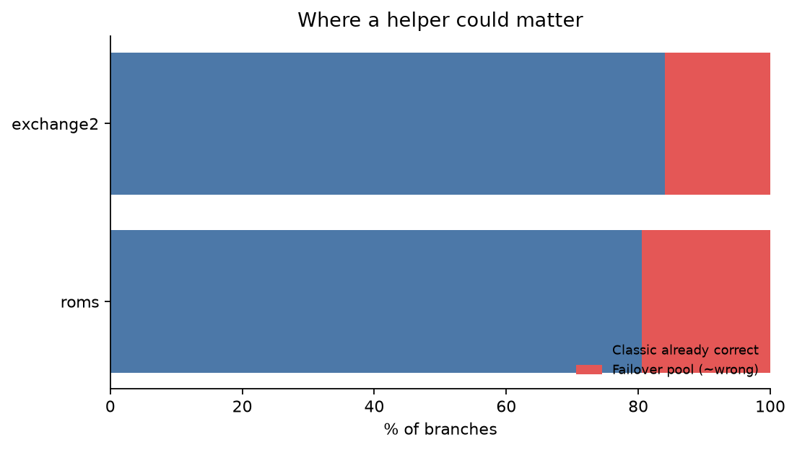

# Adaptive Neural Branch Assistance (ANBA)

### A short ChampSim side-try: tiny neural failover for uncertain branches  
**Status:** fun research incident / workshop-style note — not a claim that we beat modern CPUs  
**Repo:** https://github.com/abhijayhm/cpu-branch-prediction-research  
**Author framing:** built with heavy Cursor cloud-agent help + Grok Bot coordination, minimal babysitting

---

## Abstract

We explore **Adaptive Neural Branch Assistance (ANBA)**: keep a classic branch predictor for easy branches, and consult a *tiny* neural net only when the classic predictor is uncertain (and, in the safer design, only when the net is confident).

In short ChampSim experiments on public SPEC CPU2017 traces:

- Letting the net override whenever the classic predictor hesitates **hurts** accuracy on hard held-out workloads (about **−5 to −7 percentage points** vs bimodal).
- Training with emphasis on classic mistakes + a **confidence gate** stops that self-own: we **match** classic bimodal on those same hard short runs (**~0 pp** delta).
- We do **not** claim a stable IPC win over strong heuristics yet. A chaseable future (on-device / NPU residual + runtime adaptation) is framed as **hopeful but unoptimistic**: maybe **~1–3% IPC** if things go well — not a branch-prediction rewrite.

All tables below are from real simulator runs (`fabricated: false` in repo JSON artifacts).

---

## 1. Why bother (the fun hypothesis)

Modern CPUs already have excellent predictors. The interesting question is not “can an NN classify branches?” but:

> Can a **small** neural assistant help **specifically where a conventional predictor is uncertain**, especially with later on-device adaptation?

ANBA treats the NN as a **failover supporter**, not a replacement.

```text
branch → classic predictor
            ├─ confident  → use classic
            └─ uncertain  → tiny NN (only if confident) → else classic
                 └─ optional online / future NPU adapt
```

---

## 2. What we built (2-hour-ish research incident energy)

End-to-end in this repo:

- ChampSim pin + baseline **bimodal**
- Trace download (Zenodo SPEC2017 ChampSim traces)
- Trace-level train/val/test splits (no leakage)
- Tiny nets **NN-A / NN-B / NN-C**, INT8 export into C++ predictors
- Modes: frozen NN, ungated hybrid, online, **residual hybrid**
- Acceptance harness + hard-workload matrices

**Labels:** training uses true branch outcomes (`taken`), never the classic predictor’s guess as the target. Classic mistakes are already “corrected” in the label because the label is reality.

---

## 3. Measured results (the honest ones)

### 3.1 Hard held-out short window (warmup 100k / sim 200k)

Branch accuracy (%):

| Workload | Classic bimodal | Ungated hybrid | Residual + gate | Online |
|---|---:|---:|---:|---:|
| `654.roms` | **80.5** | 75.6 | **80.5** | 79.8 |
| `648.exchange2` | **84.0** | 76.7 | **84.0** | 84.3 |

IPC:

| Workload | Classic | Ungated hybrid | Residual + gate | Online |
|---|---:|---:|---:|---:|
| roms | **1.51** | 1.37 | **1.51** | 1.49 |
| exchange2 | **1.68** | 1.45 | **1.68** | 1.68 |

**Punchline:** residual + confidence gate **ties** classic; ungated hybrid **loses**.







### 3.2 Where a helper could matter

On these hard traces, classic is wrong on roughly **~16–20%** of branches (the failover pool). Instrumented dumps showed ~**12%** disagreements (`predicted != taken`).



### 3.3 A friendlier smoke hint (not the hard-test claim)

On an easier short window (`649.fotonik3d`), **online** once showed roughly **~+5% IPC** vs bimodal. We treat that as a *hint*, not the headline for hard held-out evaluation.

---

## 4. What we are *not* claiming

- Not beating TAGE-class industrial predictors  
- Not a measured NPU result  
- Not a guaranteed multi‑percent product win  
- Not “the dataset was flipped wrong” — we audited labels; they’re true outcomes  

---

## 5. Chaseable future (hopeful, unoptimistic)

If a dedicated low-latency unit (e.g. tiny NPU path) handled **only worse/uncertain branches** with **runtime adaptation**:

| Stance | Estimate |
|---|---|
| **Measured now** | **~0%** boost on hard short tests (tie) |
| **Stable-ish chase target** | **~1–3% IPC** if adaptation + latency cooperate |
| **Hype** | 5%+ — possible in a dream, **not** something to stand behind yet |

This is **scenario analysis**, not a corrected experimental table.

---

## 6. Reproducibility

```bash
make accept
make hard-domain-matrix   # prior hard eval
make residual-train
make residual-matrix      # residual specialist eval
```

Artifacts: `results/parsed/*_summary.json` (`fabricated: false`).

---

## 7. Closing

This note is a **side-try**: a small neural failover idea, stress-tested quickly with ChampSim, Cursor cloud agents, and a coordinating assistant. The scientific win so far is methodological — **gating beats vibes**. The product win is still a chase.

